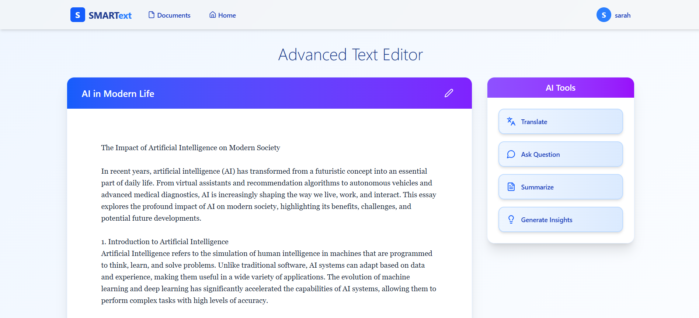
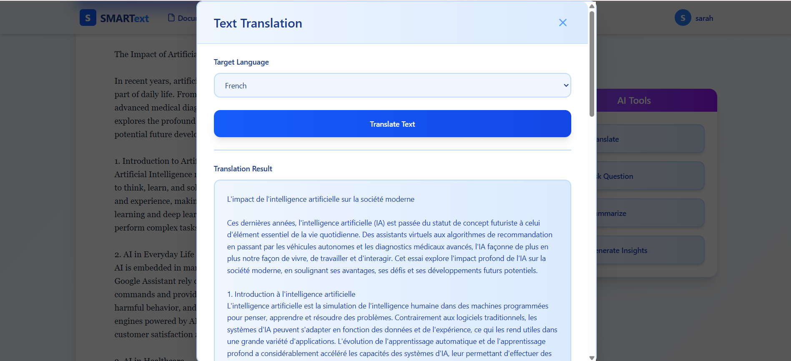
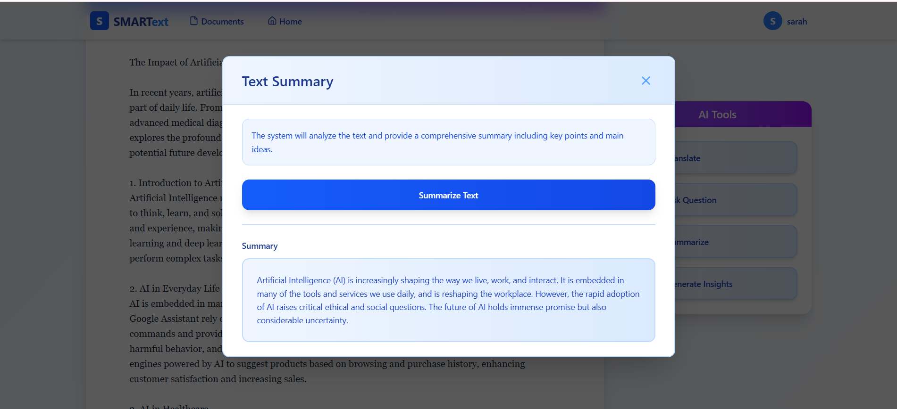

# SMARTexts – Intelligent Document Processing Platform

SMARTexts is an AI-powered platform designed to transform unstructured documents (PDF/TXT) into searchable, summarized, and multilingual insights. By integrating advanced NLP models and translation capabilities, SMARTexts extracts meaning from your documents and makes them accessible across language barriers.

## Core Features

### Document Summarization
Automatically generates high-level summaries from uploaded documents using Cohere’s command models.

### Translation (via DeepL)
Seamlessly translate summaries and insights into multiple target languages using DeepL’s high-quality translation API.

### Semantic Search (Embedding-Based)
Search your document collection using vector similarity. Find semantically related content even without exact keyword matches.

### NLP-Based Search (Prompt-Based Q&A)
Ask natural-language questions and get direct answers extracted from the documents, powered by Cohere’s generative models.

### Inference & Conclusion Extraction
Automatically detect and extract key conclusions, insights, and implications from the content—not just surface-level facts.

### Contextual Q&A
Interact with any uploaded document through natural-language questions. The system leverages semantic embeddings and large language models to extract accurate, context-aware answers based on the content of the selected document.

## Tech Stack

### Backend – Node.js
- Express.js REST API
- Cohere API (summarization, embeddings, Q&A)
- DeepL API (translation)
- pdf-parse (PDF text extraction)
- MongoDB (via Mongoose)
- dotenv, cors, fs, etc.

### Frontend – React
- React + Vite
- Tailwind CSS
- React Router
- Axios

## Project Structure

```
SMARTexts/
├── backend/
│   ├── controllers/
│   ├── routes/
│   ├── services/
│   ├── models/
│   └── server.js
├── frontend/
│   ├── src/
│   │   ├── components/
│   │   └── App.jsx
└── README.md
```

## Getting Started

1. Clone the repository:
```bash
git clone https://github.com/Sarah5567/SMARTexts.git
cd SMARTexts/backend
npm install
```

2. Create a `.env` file with:
```
PORT=5000
MONGO_URI=your_mongo_connection_uri
COHERE_API_KEY=your_cohere_api_key
DEEPL_API_KEY=your_deepl_api_key
FILE_STORAGE_PATH=your_storage_path
```
### Backend

#### Run the server

Move to backend:
```bash
cd ../back
npm node app
```

### Frontend

1. Move to frontend:
```bash
cd ../front
npm install
npm run dev
```

 2. Visit: http://localhost:5173

## Screenshots

Below are some screenshots from the SMARTexts platform:

### AllDocuments

### Document

### Translate document

### Summary

### Question

### conclusions

